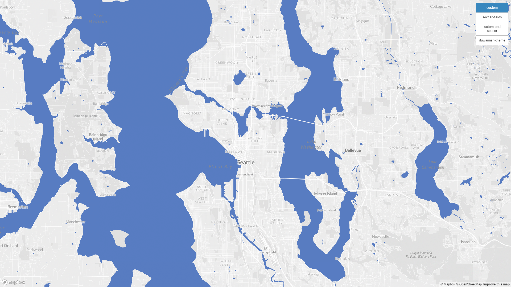

# Geography 458 Lab 4 Map Design and Tile Generation

[Map available here.](https://ehl7.github.io/geog458_lab4_tile_generation/)

The examined geographic area for this assignment is the Seattle area. All of the tile sets I created for this assignment feature available zoom levels of 4 through 14.

## Tile Set 1

This tile set is a custom base map modified from a Mapbox Monochrome base map featuring updated colors for the land and water. 

## Tile Set 2

This tile set is a thematic layer. It features point data that represents soccer fields in Seattle. The points are colored according to the type of field surface. Green represents grass fields, blue represents synthetic fields, and teal represents fields with both grass and synthetic turf. The data was retrieved from [Seattle GeoData](https://data-seattlecitygis.opendata.arcgis.com/datasets/dd701b98e6704c54bf5778bf5f49231c_0/explore?location=47.559551%2C-122.236245%2C10.96).

## Tile Set 3

This tile set combines the custom base map and the soccer field data.

## Tile Set 4

This tile set is a custom themed basemap. I wanted to create a map theme that would pay homage to the indigenous people of the area. The Duwamish people are the indigenous people of the Seattle area so I decided to base the colors off some of their traditional artwork. Based on my search, the Duwamish people's traditional artwork seems to make use of a lot of deep reds, blacks, and whites, which is what I based the colors of the map on.